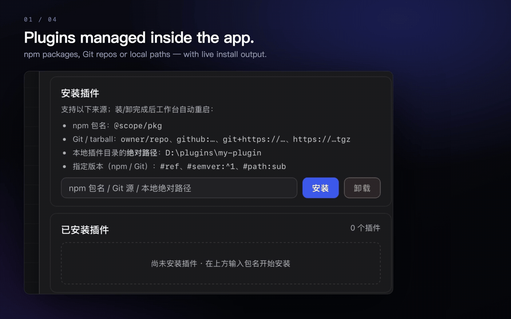

<h1 align="center">DeepSeek Harness Desktop</h1>

<p align="center">
  <b>Your dsh version. Your call.</b><br>
  <sub>Install any released version · switch anytime · roll back · upstream releases need <b>no app release</b> · shares the same <code>~/.dsh</code> as your terminal</sub>
</p>

<p align="center">
  <a href="https://github.com/Jedeiah/dsh-desktop/releases/latest"></a>
  <a href="LICENSE"></a>
  
  <a href="https://tauri.app"></a>
</p>

<p align="center">
  <a href="README.md">中文</a> · <b>English</b>
</p>

<p align="center">
  
</p>

<p align="center">
  
</p>

<p align="center">
  <sub>Double-click to run — no Node, npm, dsh or any dev environment. The runtime is bundled; dsh itself is installed on demand.</sub>
</p>

> **The upstream project also ships an official desktop app** (Electron, runtime bundled in, no public builds as of 2026-09-15).
> The two take different trade-offs: the official one fuses shell and dsh into **one signed unit**; this one is a **thin shell** that hands dsh back to you.
> See [Relationship to the official desktop app](#relationship-to-the-official-desktop-app).

---

## What this is

**DeepSeek Harness Desktop is a desktop shell for the official [DeepSeek Harness](https://github.com/deepseek-ai/deepseek-harness) (`dsh`).** It moves `dsh web` out of the terminal and into a native window: what runs inside is the **official dsh workbench itself** — the same UI, the same data as running `dsh web` in your terminal.

It is **not** a fork and **not** a plugin bundle: it does not patch dsh, inject code, or change its behavior. The shell does exactly four things:

1. **Launch `dsh web` without a terminal** (installs dsh on first run)
2. **dsh lifecycle**: install, update, install a specific version, roll back
3. **Self-update**: check GitHub Releases → download and verify → install in place
4. **Plugin management**: list, install, uninstall — the one service surface over dsh's "everything is a plugin" architecture

### Why a thin shell

The app does **not** bundle dsh. It bundles a Node runtime + npm + pnpm (macOS DMG ≈ 56MB, Windows installer ≈ 31MB) and uses the bundled pnpm on first launch to install the official `@deepseek-ai/dsh` from the npm registry into the app's data directory.

That buys three things:

- **Stay current with upstream** — dsh iterates fast during preview; a thin shell never needs a new app release just to pick up a dsh release.
- **Version control** — install a specific version, switch, roll back; the current and previous versions are both kept on disk.
- **Zero drift** — it runs the official package, and `~/.dsh` (config, sessions, credentials) is **shared with the terminal**: sessions created in the terminal show up in the app and vice versa.

---

### Relationship to the official desktop app

The upstream repository contains **an official desktop app** (`apps/desktop`, package `@deepseek-ai/dsh-desktop`, Electron, version `0.1.6-alpha.1` at the time of writing). Per its README and packaging config:

- **Electron shell + the full dsh runtime inside** (`extraResources/dsh` carries the whole production dependency tree), and the Electron version is **pinned to the exact `@deepseek-ai/dsh` version** — in its own words: "a dsh upgrade is a Desktop release, even if no shell code changed".
- **Data layer shared with the CLI** (`$DSH_HOME` sessions, settings, credentials, workspaces), but **execution dependencies and plugin activation are isolated**: it owns `$DSH_HOME/profiles/desktop`, brings its own Node and pnpm, and the CLI cannot launch or modify that profile.
- **No listening port** — requests travel over an inter-process pipe plus a custom `dsh-app://` protocol instead of a local web server.
- **Signed and notarized** (macOS notarization, Windows EV signing), distributed through object storage + `latest-*.yml`.
- **No public builds so far** (2026-09-15): zero GitHub Release assets, npm package marked `private`.

The two are not in conflict — they are two different roads. **One fuses everything into a signed whole; the other is a thin shell that treats dsh as an external dependency you manage.** The practical consequences:

| | This app (thin shell · Tauri) | Official desktop (bundled · Electron) |
|---|---|---|
| dsh version | Any released version: install, switch, roll back (current + previous kept) | Pinned to the shell version; changing dsh means changing the whole app, and there is no rollback |
| Following upstream | Upstream release needs **no app release** (installed from the registry) | Every dsh upgrade requires a Desktop release |
| Installer size | ≈ 56MB (DMG) / ≈ 31MB (Windows installer); dsh downloaded on demand | Full dependency tree bundled; noticeably larger |
| First launch | Needs network to install dsh (≈ 300MB, usually under a minute) | **Works offline** (runtime is inside) |
| Relationship to the terminal | **Same profile** (`~/.dsh/profiles/web`): sessions, credentials, workspaces, plugins all shared | Data coexists in `$DSH_HOME`, execution deps and plugin activation isolated (separate profiles) |
| Open workbench in a browser | Yes (the workbench *is* a local HTTP service) | No (`webServer` is not exposed; "Open In…" is disabled) |
| Plugin management | List / install / uninstall from npm, Git, or **local absolute paths**, with source shown and live output | Separate plugin window: list / install / uninstall / update, with update checks |
| Code signing | **Unsigned**: macOS needs one right-click on first launch; Windows may show SmartScreen | Signed + notarized |
| Platform artifacts | macOS arm64, Windows x64 (no Intel build yet) | macOS arm64 / x64, Windows x64 |
| Architecture | Workbench on local HTTP bound to `127.0.0.1` only; IPC limited to two event permissions | No listening port (pipe + custom protocol); runtime verified as one signed update unit |

> The left column is what this project implements and has tested; the right column is quoted from upstream `apps/desktop/README.md`, its electron-builder config, and the actual state of its Releases (checked 2026-09-15). The official version is still evolving — treat its repo as the source of truth.

---

## Highlights

| | |
|---|---|
| **Zero environment dependencies** | No Node, npm, bun, Python or any dev environment required — the runtime is bundled and dsh is installed by the app. Deleting your dev environment does not break it |
| **Zero drift** | No injection, no patching: it runs the official package, and `~/.dsh` is fully shared with the terminal |
| **Double-click to run** | Native window and native tray — no terminal, no port flags, no "cd into the right directory first" |
| **Pick your dsh version** | One click to the latest; type a version number to install it (validated before download); the installed-version list offers install / switch / roll back per row |
| **Plugin management** | Bundled pnpm; list / install / uninstall with live output; shares `profiles/web` with the terminal and restarts the workbench to apply |
| **Self-update** | About pane → check → download (SHA-256 verified) → install → restart on the new version |
| **Clean uninstall** | Two modes: keep `~/.dsh`, or remove sessions and credentials too. macOS moves the app to Trash; Windows uses the system uninstall chain. Only exact paths named after the app's bundle id (plus its own temp packages) are touched |
| **Native desktop behaviour** | Closing the window hides to tray, single instance, Dock/tray recall, automatic restart after a crash, system notifications |
| **Keyboard-first** | Command palette (`⌘K` / `Ctrl+K`), `⌘1`–`⌘4` to jump between sections, `Esc` to dismiss layer by layer — these work even when focus is inside the workbench |
| **English / 中文** | The UI language **follows dsh's locale** (`locale.preference` in `~/.dsh/settings.yaml`): switching updates the shell, tray and menu bar within about a second, **without a restart**; fallback chain `dsh setting → system LANG → zh` |

---

## Platform support

| Platform | Status | Artifacts | Notes |
|---|---|---|---|
| macOS (Apple Silicon / arm64) | ✅ | `*.dmg`, `*.zip` | macOS 12.0+ |
| Windows (x64) | ✅ | `*-setup.exe`, `*.zip` | Windows 10 / 11; needs the WebView2 runtime (usually preinstalled; the installer fetches it if missing) |
| macOS (Intel / x86_64) | ⚠️ no artifact | — | CI builds arm64 only. Build from source, or wait for support |
| Linux | ❌ | — | Untested; contributions welcome |

---

## Install

### One-liner (recommended — always the latest stable release)

**macOS**

```bash
curl -sSL https://raw.githubusercontent.com/Jedeiah/dsh-desktop/main/scripts/install.sh | bash
```

**Windows (PowerShell)**

```powershell
powershell -ExecutionPolicy Bypass -Command "irm https://raw.githubusercontent.com/Jedeiah/dsh-desktop/main/scripts/install.ps1 | iex"
```

Both scripts resolve the latest stable release, quit a running instance, download it, **verify SHA-256**, install, and launch.

### Manual

**macOS**

1. Download `DeepSeek.Harness.Desktop_<version>_aarch64.dmg`
2. Open the DMG and drag **DeepSeek Harness Desktop.app** into Applications
3. **Right-click → Open** the first time (the app is unsigned and needs one confirmation); afterwards a normal double-click works
4. If macOS says the app "is damaged" (common for unsigned apps downloaded by a browser):

```bash
xattr -dr com.apple.quarantine "/Applications/DeepSeek Harness Desktop.app"
```

**Windows**

- Download `DeepSeek.Harness.Desktop_<version>_x64-setup.exe` and run it (no admin needed; installs to `%LOCALAPPDATA%\DeepSeek Harness Desktop`), or
- Download `DeepSeek-Harness-Desktop-Windows-x64.zip`, unzip, and run `dsh-desktop.exe` (portable, runtime still bundled)

> Every artifact ships with a `<artifact>.sha256` file. Note that the file records the **CI-side filename** (with directory and spaces), so don't run `shasum -c` on it — compute `shasum -a 256 <your downloaded file>` (macOS) or `Get-FileHash -Algorithm SHA256` (Windows) and compare with the first field in the `.sha256` file.

---

## First launch

When no dsh installation is found, the app shows a setup screen (dsh is not started yet):

1. The **newest version in the list is preselected** (highest semver, usually upstream `latest`). Hit install: the bundled pnpm downloads and installs it, runs two self-checks, atomically switches, and enters the workbench automatically.
2. **Advanced options** let you change the **registry** (defaults to the `registry.npmmirror.com` mirror; switch back to `registry.npmjs.org` or anything else) and pin a **specific version** (list read from the registry, semver-descending, five shown, or type a version directly).
3. The install can be **cancelled at any time** without touching your data; failures show an error and a retry.
4. Once installed, dsh web starts automatically and the workbench appears in the window.

After that, every launch goes straight to the workbench.

---

## Interface

The shell is "a full-window workbench plus one collapsible top bar"; all management lives in the **command palette** and the **management drawer**:

<p align="center">
  
  <br>
  <sub>The workbench: a native window with a 36px top bar over the official dsh web UI (the same one you get from <code>dsh web</code>)</sub>
</p>

<p align="center">
  
  <br>
  <sub>The management drawer (plugins section shown). The workbench steps aside while the drawer or palette is open, then returns</sub>
</p>

- **Top bar** — left: "Workbench" (click to reload, double-click to open the current address in your browser); right: "Manage" and "Collapse navigation".
- **Command palette** — click "Manage" or press `⌘K` / `Ctrl+K` to search and run in place: workbench / dsh / plugins / about, reload workbench, open in browser, check for dsh updates, check for app updates, collapse/expand navigation.
- **Management drawer** — slides out on the right with **dsh / plugins / about** sections; the left edge is draggable (double-click to reset).
- **Collapsible navigation** — collapse the top bar into an 8px handle so the workbench can use the full window; restore from the handle or `⌘K`.

### Shortcuts

| Action | macOS | Windows |
|---|---|---|
| Command palette | `⌘K` | `Ctrl+K` |
| Jump to section | `⌘1` / `⌘2` / `⌘3` / `⌘4` | `Ctrl+1` / `2` / `3` / `4` |
| Dismiss layer by layer | `Esc` (confirm → palette → drawer) | same |
| Select in a panel | `↑` `↓`, `Enter` to run | same |
| Reload workbench | click "Workbench" in the top bar | same |
| Open workbench in browser | double-click "Workbench" | same |
| Quit | `⌘Q` or tray *Quit* | tray *Quit* |

> The workbench is a separate native WebView, so key events do not bubble to the shell page. An injected script forwards exactly five combinations — **`⌘/Ctrl+K` and `⌘/Ctrl+1–4`** — back to the shell (`shell:shortcut`), which is why they work with focus inside dsh. `Esc` is not forwarded (dsh uses it itself) and only acts on shell overlays.

---

## Features

### dsh version management

Management drawer → **dsh**.

- **Current version** — the running dsh version. `latest` is checked silently at startup; a newer release is surfaced in the dsh section (**never installed automatically**).
- **Update to latest** — install `latest` → self-check → atomic switch → the workbench restarts on the new version.
- **Specific version** — the five most recent releases (semver-descending), each row offering **install / switch / roll back** depending on state, with a confirmation; or type a version number (existence is validated before download, so a missing version fails instantly instead of downloading hundreds of MB).
- **Rollback** — a dedicated rollback button for the highest installed version below the current one.
- **Registry** — stored in `settings.json`, switchable at any time and applied on the next list refresh.
- **Fail-safe** — a failed install or update never affects the currently usable version; installs can be cancelled; the `current` marker is switched atomically (old directory moved aside first, restored on failure).

### Plugin management

Management drawer → **plugins**.

- **List** — reads installed plugins from `~/.dsh/profiles/web` (fully shared with the terminal dsh), each row showing **name · status · source** (`npm · version` / Git source / URL / local absolute path).
- **Install** — npm package names; Git or tarball sources (`owner/repo`, `github:owner/repo`, `git+ssh://…`, `git+https://…`, `https://…tgz`, with `#ref`, `#semver:` or `#path:`); or the **absolute path of a local plugin directory**.
- **Uninstall** — inline button with a dangerous-colour confirmation.
- **Live output** — pnpm output and exit codes stream as the install runs.
- **The workbench restarts automatically** so the plugin takes effect.

The bundled pnpm already handles the pnpm 11 gates: it writes `allowBuilds` authorisations and `minimumReleaseAge: 0`, parses package names to auto-authorise unapproved build scripts and retries, and sweeps leftover empty directories after uninstalls. Plugin commands are **callable only from the shell page** — the workbench is a remote origin (`http://127.0.0.1`) whose IPC Tauri denies by default (the only grant is shortcut-event forwarding), with an additional label check inside the commands as a second line of defence.

### App self-update

Management drawer → **about** → **Check for updates** (queries the latest stable GitHub Release).

If there is a new version, **Download and install** downloads the artifact to a temp directory and **verifies SHA-256** (each Release publishes `<artifact>.sha256`), then on macOS mounts the DMG and copies to `/Applications` (asking for system authorisation if needed) and restarts on the new version. On Windows it hands over to an **update helper**: it terminates child processes, and once the app has exited the helper runs the NSIS installer silently (`/S /R`) and starts the app again if nothing is running — so no process from the install directory exists during installation, avoiding Windows' "file in use" silently skipping a file. The downloaded package is deleted right after install on macOS; on Windows it is left for the helper and swept at the next launch (1-hour TTL). The result is written to the log at the next launch.

MacOS Intel machines have no artifact; the update check points at the download page instead.

### Tray, window, crash recovery

| Behaviour | macOS | Windows |
|---|---|---|
| Close window | Hides to tray (app and dsh keep running) | Same (taskbar button disappears) |
| Recall window | Left-click the tray icon or the Dock icon | Left-click the tray icon, or **launch the app again** |
| Tray menu | Show main window / Quit | Same |
| Quit | `⌘Q` or tray *Quit* — dsh is terminated with it, no orphans | Tray *Quit* — same |
| Crash recovery | dsh is restarted automatically (exponential backoff, 2s up to 15s); after 5 consecutive failures it stops and shows the log path | Same |
| Single instance | Launching again only recalls the window — never a second instance or tray icon | Same |

### Uninstall

Management drawer → **about**, bottom, two modes:

| Option | Effect |
|---|---|
| **Uninstall app only** | Removes the app, keeps `~/.dsh` (recommended: sessions, credentials and config survive for a reinstall) |
| **Full uninstall** | Also deletes sessions, credentials and config (irreversible) |

Uninstall terminates the dsh child process, then cleans app data, WebView caches (both file and directory forms of `HTTPStorages`), the workbench auth cookie, preferences (macOS additionally uses `defaults delete` to stop cfprefsd writing cached values back), and this app's own update packages in the temp area — then moves the app to Trash on macOS / invokes the system uninstaller on Windows. **Cleanup only touches exact paths named after the app's bundle id** (plus its own `dsh-desktop-update-*` temp packages); this invariant is guarded by unit tests (every target must be absolute, its last component must contain the app id, and shared parent directories are refused).

---

## Data, privacy and security

**Everything stays local. The app collects and uploads nothing.**

| Content | macOS | Windows |
|---|---|---|
| dsh config / sessions / credentials | `~/.dsh` | `%USERPROFILE%\.dsh` |
| App settings / logs / dsh closure | `~/Library/Application Support/com.dsh-desktop.app/` | `%APPDATA%\com.dsh-desktop.app\` |
| WebView cache | `~/Library/Caches/com.dsh-desktop.app/` | `%LOCALAPPDATA%\com.dsh-desktop.app\` |
| Workbench auth cookie | `~/Library/HTTPStorages/com.dsh-desktop.app.binarycookies` | inside the WebView2 data dir |
| Preferences | `~/Library/Preferences/com.dsh-desktop.app.plist` | inside the WebView2 data dir |

- **Loopback only** — dsh is forced to listen on `127.0.0.1` with a random port (`--port 0`); nothing is exposed.
- **Log redaction** — the workbench URL's `token=` and any userinfo credentials (`https://user:pass@…`) are replaced with `***` before being written to logs.
- **Minimal IPC** — the workbench is a remote origin and Tauri denies all of its IPC by default; the single grant is the permission to forward shortcut events back to the shell. Management commands are callable only from the shell page.
- **Trusted installation** — dsh is installed by the **bundled pnpm** from the npm registry (verifying `dist.integrity` sha512) and passes two self-checks before switching (`--version` and `--profile web --dump-default-config`). App updates verify SHA-256 and artifact size, and fail closed.
- **CSP** — the shell page uses a minimal policy (`default-src 'self'`, plus loopback `http`/`ws` only); the workbench is a separate native WebView top-level document and is not subject to the shell CSP.

---

## Troubleshooting

Logs (packaged builds):

- macOS: `~/Library/Application Support/com.dsh-desktop.app/logs/` (`launcher.log`, `dsh.log`, `install.log`)
- Windows: `%APPDATA%\com.dsh-desktop.app\logs\`

| Symptom | Fix |
|---|---|
| macOS: "cannot verify the developer" on first open | Right-click → Open (unsigned app) |
| macOS: "app is damaged" | `xattr -dr com.apple.quarantine "/Applications/DeepSeek Harness Desktop.app"` |
| Windows: "unknown publisher" | The app is unsigned; choose "More info → Run anyway" in SmartScreen |
| Windows: blank window / won't start | Make sure the WebView2 runtime is present (preinstalled on Win10/11; install it on older systems) |
| First-run dsh install fails | Check your network, then try the other registry in **Advanced options** |
| Blank workbench | Restart the app (it re-checks the port and login state); if it stays blank, attach `logs/launcher.log` to an issue |
| dsh crashed 5 times in a row | The app shows a dialog with the log path — `dsh.log` contains dsh's own output |
| Can't find the app after closing the window | Closing hides to tray: click the tray icon, or relaunch the app (Windows) |

---

## FAQ

**Will it conflict with a dsh installed in my terminal?**
No. The app manages its own dsh closure under its data directory, independent of any global install — while config, sessions and credentials (`~/.dsh`) are **shared**. That is what "zero drift" means here.

**Do I need Node / npm / pnpm?**
No. All of them are bundled (Node, npm, and a JS distribution of pnpm plus launcher). It runs on a machine with no dev environment at all.

**Why does the first launch download a few hundred MB?**
That is the official dsh closure (≈ 300MB including all Node-side dependencies). It is the price of *not* bundling it: the installer stays small (≈ 56MB / 31MB) and dsh becomes independently upgradable and rollback-able.

**Do I have to update dsh manually when upstream ships a release?**
The app checks silently at startup and surfaces new versions, but **never installs automatically** — whether and to which version you update is your call.

**Does updating dsh lose my sessions?**
No. Sessions live in `~/.dsh`, independent of the version; upgrading just switches which version directory `current` points at.

**Can I run two instances?**
No, and you don't need to — the app is single-instance; launching again just recalls the existing window.

**Is an unsigned app risky?**
Unsigned means one manual confirmation on first launch (which is also why it is completely free and needs no certificate). The code, the build pipeline and the artifacts are all in this repository — you can read and build them yourself.

**Will it delete my stuff by accident?**
Uninstall only removes exact paths named after the app's bundle id (plus its own `dsh-desktop-update-*` temp packages), and every target must be a validated absolute path. `~/.dsh` is deleted only if you explicitly choose **Full uninstall**.

---

## Technical notes

**Process model** — the app is a single native process (Rust + Tauri 2) hosting one dsh child process: shell page, workbench (a native child WebView), dsh child process and data directories are layered as shown in `docs/images/architecture.png`.

The shell page and the workbench are deliberately separated: the workbench is a **native view** (always painted above HTML), so opening the drawer or palette explicitly moves the workbench out of the window and moves it back on close; collapsing the top bar is a native geometry animation (boundaries sampled per frame from a CSS `cubic-bezier`).

**Environment consistency (macOS)** — launched by Finder/launchd, the app inherits a minimal environment. Before starting dsh it captures the environment of your login shell (PATH, LANG, including paths injected by fnm, Homebrew, bun) and merges it into the child process, so commands run in the workbench see the same environment as your terminal.

**dsh closure management** — under `<app-data>/dsh/` the app keeps a plain-text `current` marker (so no symlink privileges are needed on Windows), `v<version>/` directories, and a `pnpm-store/` (content-addressed, so `~/.npm` and `~/.pnpm-store` stay untouched). Install flow: install into `v<new>-<pid>.tmp` → double self-check → write VERSION → publish as `v<new>` (old directory moved aside first, restored on failure) → atomically switch `current` → clean tmp → restart the workbench. Garbage collection always keeps the current and previous versions for rollback.

---

## Known limitations

- **Unsigned / not notarized** — macOS needs one right-click on first launch; Windows may show SmartScreen. Removing this requires certificates.
- **macOS arm64 only** — CI does not produce Intel artifacts (build from source if needed).
- **WebView2 dependency** — Windows needs the WebView2 runtime (bundled with Win10/11); the installer fetches it online if missing.
- **Preview-era interfaces** — the shell depends on dsh's `--profile web`, `--port 0` and a stdout readiness line; upstream changes may require the shell to follow.

Planned, without promises: code signing and notarization, macOS Intel and Linux builds, multiple profile switching, log rotation and a one-click diagnostic bundle.

---

## Contributing

Issues and PRs are welcome — especially **platform testing feedback** (Windows vs macOS behaviour, WebView2 environments) and documentation fixes.

Before submitting, make sure `cargo clippy --all-targets` is warning-free, `cargo test` passes, and `node --check apps/desktop/ui/*.js` passes; for interaction changes, follow `docs/regression-checklist.md`.

Thanks to [Tauri](https://tauri.app) (desktop shell), [DeepSeek Harness](https://github.com/deepseek-ai/deepseek-harness) (the workbench itself) and [pnpm](https://pnpm.io) (closure and plugin installation).

---

## License

[MIT](LICENSE), same as upstream [deepseek-harness](https://github.com/deepseek-ai/deepseek-harness).
