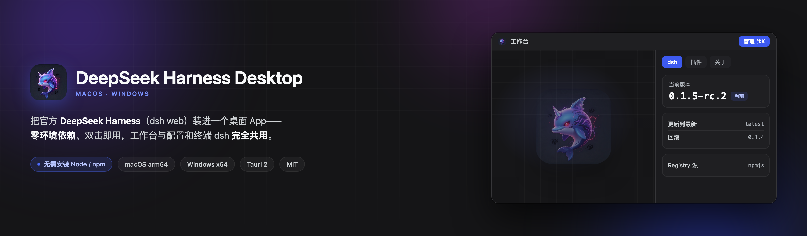
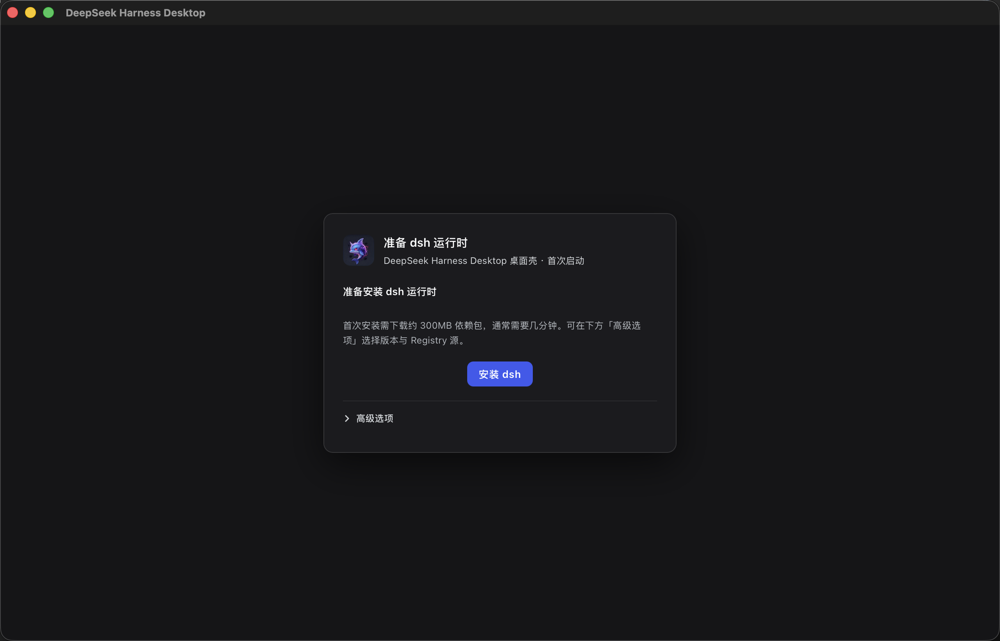
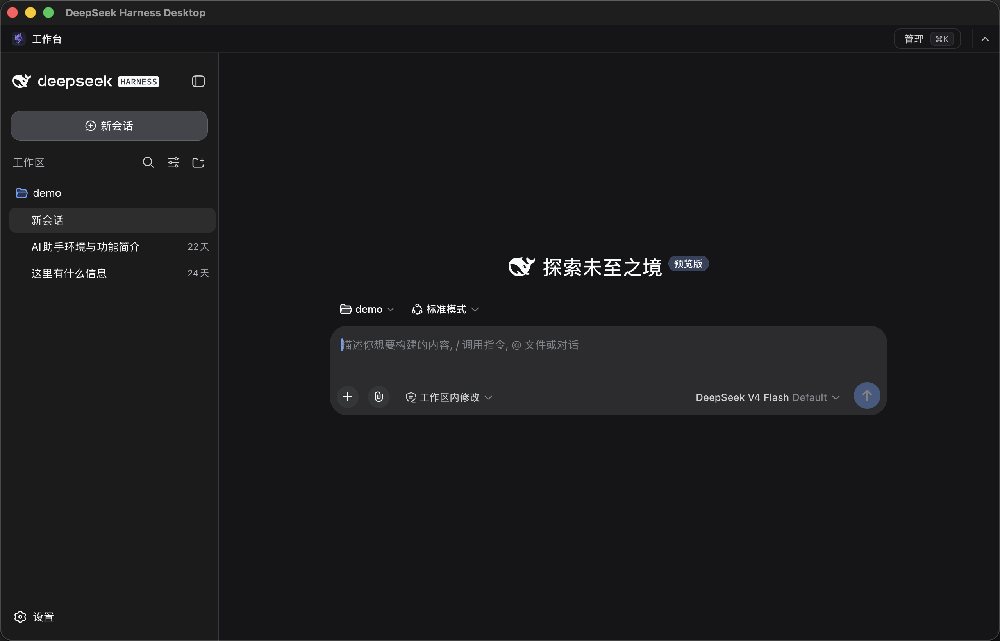
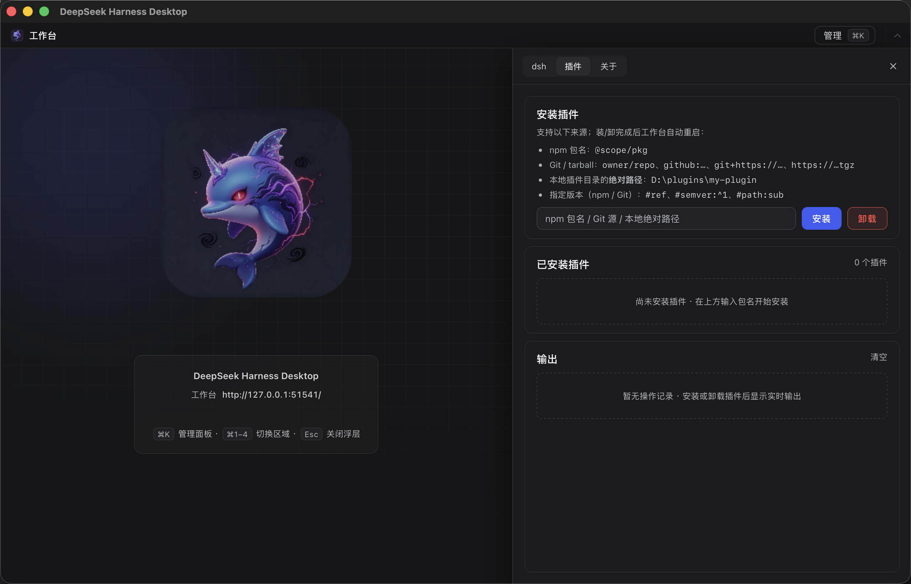
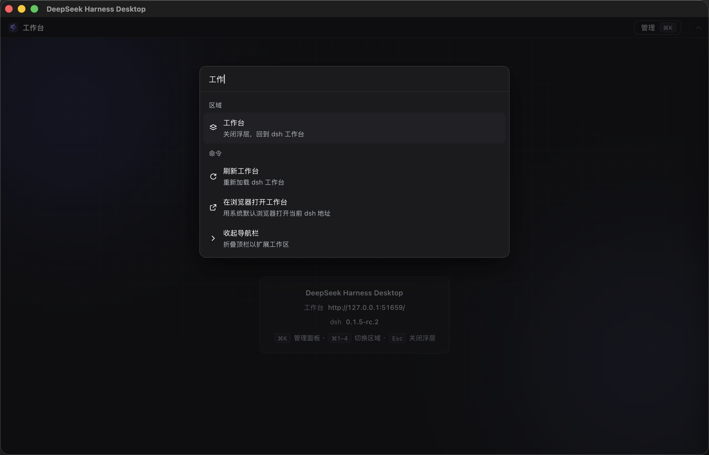
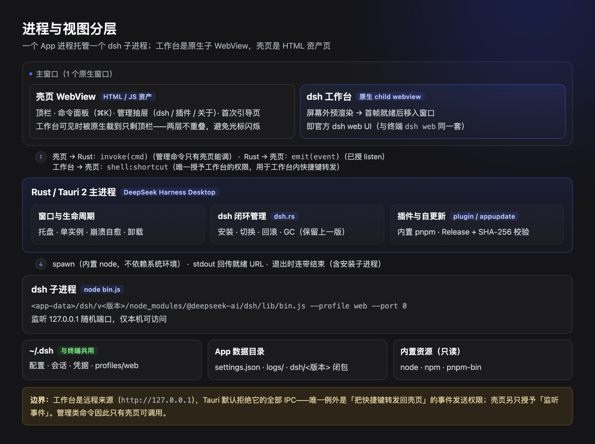

<h1 align="center">DeepSeek Harness Desktop</h1>

<p align="center">
  <b>dsh 的版本，由你决定。</b><br>
  <sub>可安装任意已发布版本、随时切换、回滚到上一版 · 上游发新版<b>不必等 App 发版</b> · 与终端 dsh <b>共用同一份 <code>~/.dsh</code></b>（会话、凭据、插件都是同一套）</sub>
</p>

<p align="center">
  <a href="https://github.com/Jedeiah/dsh-desktop/releases/latest"></a>
  <a href="LICENSE"></a>
  
  <a href="https://tauri.app"></a>
</p>

<p align="center">
  
</p>

<p align="center">
  <sub>双击即用，不需要 Node / npm / dsh 或任何开发环境——运行时内置，dsh 按需安装。</sub>
</p>

> **上游也有一个官方桌面端**（Electron 实现、把 dsh 运行时打包进 App、截至目前未公开发布）。
> 两条路的取舍不同：官方版把 shell 与 dsh 绑成**一个签名整体**；我们是**瘦壳**，把 dsh 交给你管。
> 具体差别见 [与官方桌面端的关系](#与官方桌面端的关系)。

---

## 目录

- [这是什么](#这是什么)
  - [与官方桌面端的关系](#与官方桌面端的关系)
- [亮点](#亮点)
- [平台支持](#平台支持)
- [安装](#安装)
- [首次启动](#首次启动)
- [界面与操作](#界面与操作)
- [功能详解](#功能详解)
  - [dsh 版本管理](#dsh-版本管理)
  - [插件管理](#插件管理)
  - [App 自身更新](#app-自身更新)
  - [托盘、窗口与崩溃自愈](#托盘窗口与崩溃自愈)
  - [卸载](#卸载)
- [数据、隐私与安全](#数据隐私与安全)
- [故障排查](#故障排查)
- [常见问题](#常见问题)
- [技术架构](#技术架构)
- [开发与构建](#开发与构建)
- [发版流程](#发版流程)
- [目录结构](#目录结构)
- [已知限制与路线](#已知限制与路线)
- [贡献与致谢](#贡献与致谢)
- [License](#license)

---

## 这是什么

**DeepSeek Harness Desktop 是官方 [DeepSeek Harness](https://github.com/deepseek-ai/deepseek-harness)（`dsh`）的桌面外壳。** 它把 `dsh web` 从终端搬进一个原生窗口：窗口里运行的就是**官方 dsh 工作台本体**，和你在终端执行 `dsh web` 看到的是同一套界面、同一份数据。

它**不是**二次开发，也**不是**插件集合：不修改 dsh、不注入任何代码、不改变它的行为。壳只负责四件事——

1. **免终端启动** `dsh web`（首次运行自动安装 dsh）
2. **dsh 生命周期管理**：安装、更新、指定版本安装、回滚
3. **App 自身更新**：检查 GitHub Releases → 下载校验 → 一键安装
4. **插件管理**：列出已装插件、安装 / 卸载（对 dsh「万物皆插件」的唯一服务面）

### 为什么是「瘦壳」

App **不内置 dsh**，只内置 Node 运行时 + npm + pnpm（macOS 安装包约 56MB，Windows 安装器约 31MB）；首次启动时用内置 pnpm 把官方 `@deepseek-ai/dsh` 从 npm registry 装到 App 数据目录。

这样换来三件事：

- **随时跟上上游**：dsh 预览期迭代很快，瘦壳不需要为每次 dsh 发版重新打包发布 App。
- **版本可管理**：能装指定版本、能回滚，当前版本与上一版本各留一份。
- **零偏差**：跑的就是官方包，`~/.dsh` 配置/会话/凭据与终端 dsh 完全共用——终端里建过的会话，打开 App 就能看到；反过来也一样。

---

### 与官方桌面端的关系

上游仓库里**有一个官方桌面端**（`apps/desktop`，包名 `@deepseek-ai/dsh-desktop`，Electron 实现，写作时版本 `0.1.6-alpha.1`）。按它自己的 README 与打包配置，它是这样定位的：

- **Electron 外壳 + 内置完整 dsh 运行时**（`extraResources/dsh` 携带完整生产依赖树），且 Electron 版本与 `@deepseek-ai/dsh` **严格同版本**——用它的原话说：「dsh 升级即一次 Desktop 发布，哪怕 shell 代码没变」；
- **数据层与 CLI 共享**（`$DSH_HOME` 下的会话、设置、凭据、工作区、存储），但**执行依赖与插件激活隔离**：它独占 `$DSH_HOME/profiles/desktop`，自带 Node 与 pnpm，CLI 不能启动或修改这个 profile；
- **不开监听端口**：用进程间管道 + 自定义 `dsh-app://` 协议承载请求，而不是一个本地 Web 服务；
- **有签名与公证**（macOS notarization、Windows EV 签名），走对象存储 + `latest-*.yml` 通道分发；其 README 把「发布签名、公证、更新托管、上一版本校验」列为依赖生产发布环境的事项。
- **截至目前（2026-09-15）没有公开产物**：它的 GitHub Releases 资产数为 0，npm 包标记为 `private`，因此现在拿不到公开下载。

我们和它不冲突，是两条路：**它把一切打成一个经过签名的整体；我们是瘦壳，把 dsh 当成外部依赖来管理。** 由此产生的实际差别：

| 维度 | 本 App（瘦壳 · Tauri） | 官方桌面端（内置 · Electron） |
|---|---|---|
| dsh 版本 | 可装任意已发布版本、可切换、可回滚（当前与上一版各留一份） | 与 shell 严格同版本；换 dsh 版本等于换整个 App，且无回滚 |
| 跟随上游 | 上游发新版**不需要重发 App**（首次/更新时从 registry 装） | 每次 dsh 升级都要发一个 Desktop release |
| 安装包体积 | 约 56MB（DMG）/ 约 31MB（Windows 安装器），dsh 按需下载 | 内置完整依赖树，包体显著更大 |
| 首次启动 | 需要联网安装 dsh（约 300MB，通常几十秒到几分钟） | **离线即可用**（运行时已内置） |
| 与终端的关系 | 共用**同一个 profile**（`~/.dsh/profiles/web`）：会话、凭据、工作区、插件全共用 | 数据共存于 `$DSH_HOME`，但执行依赖与插件激活隔离（各用各的 profile） |
| 在浏览器打开工作台 | 支持（工作台本身就是本地 HTTP 服务） | 不可用（官方自述：Desktop 不提供 `webServer`，故 "Open In…" 被禁用） |
| 插件管理 | 列表 / 安装 / 卸载，支持 npm、Git 源、**本地绝对路径**，显示来源，实时输出 | 独立的插件窗口，支持列表 / 安装 / 卸载 / 更新与检查更新 |
| 代码签名与公证 | **未签名**：macOS 首次需右键打开，Windows 可能过 SmartScreen | 已签名 + 公证 |
| 平台产物 | macOS arm64、Windows x64（暂无 Intel 版） | macOS arm64 / x64、Windows x64 |
| 架构面 | 工作台跑在仅绑 `127.0.0.1` 的本地 HTTP 上，IPC 只授两条事件权限 | 不开监听端口（管道 + 自定义协议），运行时作为签名更新单元整体校验 |

> 左列是我们自己实现并实测过的事实；右列摘自上游 `apps/desktop/README.md` 与其 electron-builder 配置、以及仓库 Releases 的实际状态（核对于 2026-09-15）。官方版本仍在演进，请以其仓库为准。

---

## 亮点

| 亮点 | 说明 |
|---|---|
| **零环境依赖** | 不需要 Node、npm、bun、Python 或任何开发环境——运行时全部内置，dsh 由 App 自动安装。删掉电脑上的开发环境也不影响它运行 |
| **零偏差** | 不注入、不魔改，跑官方 dsh；`~/.dsh` 与终端完全共用，随时可回到终端继续 |
| **双击即用** | 原生窗口 + 原生托盘，无终端、无端口参数、无「先 cd 到哪个目录」 |
| **dsh 版本随心换** | 一键更新到最新；输入版本号安装（下载前先校验存在性）；已装版本列表按状态给出 安装 / 切换 / 回滚 |
| **插件管理** | 内置 pnpm，列表 / 安装 / 卸载 / 实时输出；与终端共用 `profiles/web`，装完自动重启工作台生效 |
| **App 内更新** | 关于页检查新版 → 下载（SHA-256 校验）→ 安装 → 自动重启到新版本 |
| **干净的卸载** | 两档卸载：保留 `~/.dsh`（便于重装）或连会话凭据一起删；macOS 移入废纸篓、Windows 走系统卸载链；只清理以本 App bundle id 命名的精确路径与自产临时包（`dsh-desktop-update-*`） |
| **标准桌面体验** | 关窗口收进托盘、单实例（不会开双托盘）、Dock / 托盘召回、崩溃自动重启、系统通知 |
| **键鼠齐全** | 命令面板（`⌘K` / `Ctrl+K`）、`⌘1`–`⌘4` / `Ctrl+1`–`4` 直达区域、`Esc` 逐级关闭；焦点在工作台里也能用（按键由工作台转发回壳页） |

---

## 平台支持

| 平台 | 状态 | 产物 | 说明 |
|---|---|---|---|
| macOS（Apple Silicon / arm64） | ✅ 支持 | `*.dmg`、`*.zip` | 要求 macOS 12.0+ |
| Windows（x64） | ✅ 支持 | `*-setup.exe`、`*.zip` | Windows 10 / 11，需 WebView2 运行时（系统自带；缺失时安装器会联网获取） |
| macOS（Intel / x86_64） | ⚠️ 暂无产物 | — | CI 目前只构建 arm64。Intel 机请从源码构建，或等待后续支持 |
| Linux | ❌ 未支持 | — | 未测试过，欢迎贡献 |

> 便携版：Windows 也可下载 `.zip` 解压后直接双击 `dsh-desktop.exe`（同样内置运行时，无需安装）。

---

## 安装

### 一键安装（推荐，自动跟随最新正式版）

**macOS：**

```bash
curl -sSL https://raw.githubusercontent.com/Jedeiah/dsh-desktop/main/scripts/install.sh | bash
```

**Windows（PowerShell）：**

```powershell
powershell -ExecutionPolicy Bypass -Command "irm https://raw.githubusercontent.com/Jedeiah/dsh-desktop/main/scripts/install.ps1 | iex"
```

两个脚本都会：解析最新正式版 → 退出正在运行的实例 → 下载 → **校验 SHA-256** → 安装 → 启动。

### 手动安装

**macOS**

1. 下载 `DeepSeek.Harness.Desktop_<版本>_aarch64.dmg`；
2. 打开 DMG，把 **DeepSeek Harness Desktop.app** 拖进「应用程序」；
3. 首次打开请**右键 → 打开**（应用未签名，需确认一次），之后正常双击即可；
4. 若提示「已损坏，无法打开」（浏览器下载未签名 App 的常见现象）：

```bash
xattr -dr com.apple.quarantine "/Applications/DeepSeek Harness Desktop.app"
```

**Windows**

- 下载 `DeepSeek.Harness.Desktop_<版本>_x64-setup.exe` 双击安装（免管理员，装到当前用户 `%LOCALAPPDATA%\DeepSeek Harness Desktop`）；
- 或下载 `DeepSeek-Harness-Desktop-Windows-x64.zip` 解压后直接运行 `dsh-desktop.exe`（便携版）。

> 每个产物都附带 `<产物名>.sha256`。注意文件里记的是 **CI 侧文件名**（带目录与空格），所以别直接 `shasum -c`——用 `shasum -a 256 <你下载的文件>`（macOS）或 `Get-FileHash -Algorithm SHA256`（Windows）算出哈希，与 `.sha256` 文件里的第一段比对即可。

---

## 首次启动

首次启动检测到尚未安装 dsh 时，会显示**引导页**（此时不启动 dsh 进程）：

1. 默认选中 **版本列表里最新的一个**（按 semver 取最大，通常即官方 `latest`），点「安装」：内置 pnpm 下载安装（视网络，通常半分钟到几分钟）→ 双重自检 → 原子切换 → 自动进入工作台；
2. 展开「高级选项」可改 **Registry 源**（默认国内镜像 `https://registry.npmmirror.com`，可改回官方 `https://registry.npmjs.org`）与**指定版本**（列表来自 registry，按 semver 倒序，列表只显示最近 5 个，其余直接输版本号）；
3. 安装过程可**随时取消**（不影响任何数据）；失败会给出错误与**重试**；
4. 装完自动启动 dsh web，窗口里显示工作台。

<p align="center">
  
  <br>
  <sub>首次启动的引导页：默认装 latest，可展开「高级选项」改 Registry 源与指定版本</sub>
</p>

之后每次启动都是秒进工作台（无需再安装）。

---

## 界面与操作

壳页是「满屏工作台 + 一条可折叠顶栏」，所有管理能力都收在**命令面板**与**管理抽屉**里：

<p align="center">
  
  <br>
  <sub>工作台：原生窗口 + 一条 36px 顶栏，下面是官方 dsh web UI（与终端 <code>dsh web</code> 同一套）</sub>
</p>

<p align="center">
  
  <br>
  <sub>管理抽屉（图为「插件」分段）。抽屉 / 命令面板打开时工作台会按设计让位，收起后自动归位</sub>
</p>

<p align="center">
  
  <br>
  <sub>命令面板（<code>⌘K</code>）：搜区域、搜命令，回车即执行</sub>
</p>

- **顶栏**：左侧「工作台」（单击刷新工作台，双击在系统浏览器打开当前地址）；右侧「管理」与「收起导航栏」。
- **命令面板**：点「管理」或 `⌘K` / `Ctrl+K`，可就地搜索并执行——切到工作台 / dsh / 插件 / 关于，刷新工作台，在浏览器打开，检查 dsh 更新，检查应用更新，展开 / 收起导航栏。
- **管理抽屉**：右侧滑出，分 **dsh / 插件 / 关于** 三段；左边缘可拖动调整宽度（双击复位）。抽屉打开时工作台会暂时让位，收起后自动归位。
- **折叠导航栏**：把顶栏收到一条 8px 把手，工作台向上扩展；点顶部把手或按 `⌘K` →「展开导航栏」恢复。

### 快捷键速查

| 操作 | macOS | Windows |
|---|---|---|
| 命令面板 | `⌘K` | `Ctrl+K` |
| 直达区域 | `⌘1` / `⌘2` / `⌘3` / `⌘4` | `Ctrl+1` / `2` / `3` / `4` |
| 逐级关闭浮层 | `Esc`（确认弹窗 → 命令面板 → 抽屉） | 同左 |
| 面板内选择 | `↑` `↓` 移动，`Enter` 执行 | 同左 |
| 刷新工作台 | 单击顶栏「工作台」 | 同左 |
| 在浏览器打开工作台 | 双击顶栏「工作台」 | 同左 |
| 退出应用 | `⌘Q` 或托盘 *退出* | 托盘 *退出* |

> 工作台是独立的原生 WebView，按键不会冒泡到壳页。因此在工作台里按键时，由注入脚本把 **`⌘/Ctrl+K` 与 `⌘/Ctrl+1–4` 这 5 组组合键**转发回壳页处理（`shell:shortcut` 事件），所以焦点在 dsh 里也能用。`Esc` 不转发（dsh 页面自己会用到），它只在壳页浮层上生效。

### 托盘、窗口与崩溃自愈

| 行为 | macOS | Windows |
|---|---|---|
| 关闭窗口 | 隐藏到托盘（App 与 dsh 继续后台运行） | 同左（任务栏按钮随之消失） |
| 召回窗口 | 左键点托盘图标，或点 Dock 图标 | 左键点托盘图标，或**再次启动 App**（开始菜单 / 桌面快捷方式） |
| 托盘菜单 | 显示主窗口 / 退出 | 同左（悬停图标显示应用名） |
| 退出 | `⌘Q` 或托盘 *退出*：连带结束 dsh，无孤儿进程 | 托盘 *退出*：同左 |
| 崩溃自愈 | dsh 意外退出自动重启（指数退避，2s 起、上限 15s）；连续 5 次后停止并弹窗给出日志路径 | 同左 |
| 单实例 | 重复启动只会召回已有窗口，不会开第二个实例或第二个托盘图标 | 同左 |

---

## 功能详解

### dsh 版本管理

管理抽屉 · **dsh** 分段。

- **当前版本**：正在运行的 dsh 版本；启动时静默检查 registry 的 `latest`，有新版会在 dsh 段提示（**不自动安装**）。
- **更新到最新**：安装 `latest` → 自检 → 原子切换 → 工作台自动重启到新版。
- **指定版本**：列表展示最近 5 个已发布版本（semver 倒序），每行按当前状态给出 **安装 / 切换 / 回滚**，点击后二次确认；也可直接**输入版本号**安装（下载前先校验该版本存在，不存在立即提示，不会白下几百 MB）。
- **回滚**：对「低于当前版本中已安装的最高版本」给出独立回滚按钮。
- **Registry 源**：写入 `settings.json`，可随时切换并在列表刷新后生效。
- **失败安全**：任何安装/更新失败都不影响当前可用版本；安装中可取消；`current` 标记原子切换（先移开旧目录再 rename，失败自动恢复）。

### 插件管理

管理抽屉 · **插件** 分段。

- **列表**：读取 `~/.dsh/profiles/web` 已装插件（与终端 dsh 完全共用），每行显示**名称 · 状态 · 来源**（`npm · 版本` / `Git 源` / `URL` / `本地 · 绝对路径`）。
- **安装**：支持 npm 包名、Git / tarball 源（`owner/repo`、`github:owner/repo`、`git+ssh://…`、`git+https://…`、`https://…tgz`，可用 `#ref` / `#semver:` / `#path:` 指定版本），以及**本地插件目录的绝对路径**（如 `D:\plugins\my-plugin`）。
- **卸载**：行内「卸载」→ 二次确认（危险色）→ 执行。
- **实时输出**：安装/卸载过程滚动显示 pnpm 输出与退出码。
- **装完自动重启工作台生效**，无需手动操作。

内置 pnpm 已处理 pnpm 11 的门禁：写入 `allowBuilds` 授权构建脚本、`minimumReleaseAge: 0`；遇到未授权的构建脚本会解析包名自动补授权重试；卸载后自动清扫残留空目录。插件命令**只接受壳页调用**——工作台页面是远程来源（`http://127.0.0.1`），Tauri 默认拒绝其 IPC（唯一授权是快捷键事件转发）；安装/卸载命令内另有 label 校验作为第二道防线。

### App 自身更新

管理抽屉 · **关于** 分段 → **检查更新**（查询 GitHub Releases 最新正式版）。

有新版时点 **下载并安装**：下载安装包到临时目录并**校验 SHA-256**（Release 同时发布了 `<产物名>.sha256`）→ macOS 挂载 DMG 复制到 `/Applications`（无写权限时弹系统授权）→ 自动重启到新版本；Windows 交给一个**更新助手**：先结束内置 dsh 等子进程，应用退出后由助手静默运行 NSIS 安装器（`/S /R`），装完若还没有实例在运行就补一次启动——安装期间安装目录里没有任何本应用的进程，避免 Windows「运行中的文件不可写」导致某个文件被安装器静默跳过。安装包在 macOS 上装完即删；Windows 上留给助手使用、由下次启动清扫（1 小时 TTL）。更新结果会在下次启动写进日志（生效记一行；未生效则提示「上次更新到 vX 未生效」并给出日志路径）。

macOS Intel 机器没有对应产物，检查更新会提示走 **在浏览器打开下载页** 手动安装。

### 卸载

管理抽屉 · **关于** 分段最下方，两档（macOS / Windows 一致）：

| 选项 | 效果 |
|---|---|
| **仅卸载应用**（界面按钮：卸载（保留数据）） | 卸载 App，保留 `~/.dsh`（推荐：会话/凭据/配置仍在，将来重装即用） |
| **完整卸载**（界面按钮：完全卸载） | 一并删除会话、凭据、配置（不可恢复） |

卸载会依次：结束 dsh 子进程 → 清理应用数据、WebView 缓存（`HTTPStorages` 的**文件与目录两种形态**都清）、工作台认证 cookie、偏好（macOS 另经 `defaults delete` 清偏好域，避免 cfprefsd 把缓存写回磁盘）、临时区里本 App 的更新包（`dsh-desktop-update-*`）→ macOS 移入废纸篓（可恢复）/ Windows 唤起系统卸载器 → 退出。

清理的数据范围**只限以本 App bundle id 命名的精确路径**（另加本 App 自己在临时区产生的更新包 `dsh-desktop-update-*`），不会触碰系统或其它应用的数据——该不变量由单元测试守护（所有目标必须绝对路径、末段必须含 App id、共享父目录一律拒绝；临时区按固定前缀匹配，不做通配）。Windows 从「设置 → 应用」或开始菜单右键触发的卸载走同一条链，因此同样彻底；便携版没有系统卸载器，改由自身清理数据，程序文件删除所在文件夹即可。

---

## 数据、隐私与安全

**数据都在本地，App 不收集、不上传任何内容。**

| 内容 | macOS | Windows |
|---|---|---|
| dsh 配置 / 会话 / 凭据 | `~/.dsh` | `%USERPROFILE%\.dsh` |
| App 设置 / 日志 / dsh 闭包 | `~/Library/Application Support/com.dsh-desktop.app/` | `%APPDATA%\com.dsh-desktop.app\` |
| WebView 缓存 | `~/Library/Caches/com.dsh-desktop.app/` | `%LOCALAPPDATA%\com.dsh-desktop.app\` |
| 工作台认证 cookie | `~/Library/HTTPStorages/com.dsh-desktop.app.binarycookies` | WebView2 数据目录内 |
| 偏好 | `~/Library/Preferences/com.dsh-desktop.app.plist` | WebView2 数据目录内 |

- **只绑 loopback**：dsh 强制监听 `127.0.0.1`，端口由系统随机分配（`--port 0`），不对外暴露。
- **日志脱敏**：工作台 URL 里的 `token=` 以及 URL 里的 userinfo 凭据（`https://user:pass@…`）在写入日志前都会被替换为 `***`。
- **IPC 最小授权**：工作台是远程来源，Tauri 默认拒绝它的全部 IPC；唯一授予它的是「把快捷键转发回壳页」的事件发送权限（`capabilities/workbench-shortcut.json`），壳页另只授予「监听事件」（`capabilities/shell-events.json`）。管理类命令只有壳页能调用。
- **安装可信**：dsh 由**内置 pnpm** 从 npm registry 安装（校验元数据 `dist.integrity` sha512），切换前做双重自检（`--version` + `--profile web --dump-default-config`）；App 更新校验 SHA-256 与产物大小，不符即失败并清理。
- **CSP**：壳页为最小策略（`default-src 'self'`，仅额外放行 loopback 的 `http`/`ws`——`127.0.0.1` 与 `localhost`；样式允许内联）；工作台是独立原生 WebView 的顶层文档，不受壳页 CSP 约束。

---

## 故障排查

日志位置（打包态）：

- macOS：`~/Library/Application Support/com.dsh-desktop.app/logs/`（`launcher.log` + `dsh.log` + `install.log`）
- Windows：`%APPDATA%\com.dsh-desktop.app\logs\`

| 现象 | 处理 |
|---|---|
| macOS 首次打开提示无法验证开发者 | 右键 → 打开（未签名应用） |
| macOS 提示「已损坏，无法打开」 | `xattr -dr com.apple.quarantine "/Applications/DeepSeek Harness Desktop.app"` |
| Windows 提示「未知发布者」 | 应用未签名，SmartScreen 里选择「仍要运行」 |
| Windows 白屏 / 启动异常 | 确认系统有 WebView2 运行时（Win10/11 自带；老系统需安装 [WebView2 Runtime](https://developer.microsoft.com/en-us/microsoft-edge/webview2/)） |
| 首次引导装不上 dsh | 检查网络；在「高级选项」换一个 Registry 源重试（默认是国内镜像 `registry.npmmirror.com`，可换成官方 `registry.npmjs.org`，或反之） |
| 工作台空白 | 重启 App（会自动检查端口与登录态）；仍空白请把 `logs/launcher.log` 贴到 issue |
| dsh 连续崩溃 5 次 | 应用会弹窗并给出日志路径，**其中 `dsh.log` 记录了 dsh 的异常输出** |
| 关掉窗口后找不到应用 | 关窗口 = 收进托盘：点托盘图标，或（Windows）重新启动一次 App |
| 想彻底重来 | 删除 App（macOS 拖进废纸篓 / Windows 走卸载），再删 `~/.dsh` 与上表的 App 数据目录 |

---

## 常见问题

**会和终端里装的 dsh 冲突吗？**
不会。App 管理的是自己数据目录下的 dsh 闭包，与全局安装互不干扰；而配置、会话、凭据（`~/.dsh`）是**共用**的——这正是「零偏差」的意思。

**需要装 Node / npm / pnpm 吗？**
不需要。都内置在 App 里（Node + npm + pnpm 的 JS 发行版 + 启动器）。系统里没有开发环境也能跑。

**为什么首次启动要装几百 MB？**
装的是官方 dsh 闭包（约 300MB，含 Node 侧全部依赖）。这就是「不打包进安装包」的代价：安装包小（约 56MB / 31MB）、dsh 可独立升级回滚。

**dsh 有新版需要我手动更新吗？**
App 启动时会静默检查并在 dsh 段提示，但**不会自动安装**——是否更新、更新到哪个版本由你决定。

**更新 dsh 会丢会话吗？**
不会。会话在 `~/.dsh`，与版本无关；闭包升级只是切换 `current` 指向的版本目录。

**能同时开两个吗？**
不能，也不需要——单实例：重复启动只会召回已有窗口。

**应用未签名会有风险吗？**
未签名意味着首次打开需要你手动确认（这也是它完全免费、不需证书的原因）。代码、构建流程、产物都在本仓库，可自行审阅与构建。

**会不会误删我的东西？**
卸载只清理以 App bundle id 命名的精确路径（另加自产临时包 `dsh-desktop-update-*`），且所有目标必须是通过校验的绝对路径；`~/.dsh` 仅在明确选择「完整卸载」时才删除。

---

## 技术架构

> 下面几节给想自己折腾或贡献代码的人。日常使用不需要读。

**进程模型**：App 是单个原生进程（Rust + Tauri 2），它托管一个 dsh 子进程——壳页、工作台（原生子 WebView）、dsh 子进程与数据目录的分层关系如下图：

<p align="center">
  
</p>

壳页与工作台之间的分工是刻意设计的：工作台是**原生视图**（永远画在 HTML 之上），所以「打开抽屉/命令面板」时会显式把工作台移出窗口，收起后再移回；顶栏折叠则是原生化几何动画（按 CSS `cubic-bezier` 采样逐帧下发边界）。

**环境一致性（macOS）**：App 由 Finder/launchd 启动，继承的是最小环境。启动 dsh 前会捕获一次用户登录交互 shell 的环境（PATH / LANG 等，含 fnm、Homebrew、bun 注入的路径）并合并进子进程——因此工作台里执行命令的环境与你的终端一致。捕获失败则静默沿用原环境。

**dsh 闭包管理**（`dsh.rs`）：`<app-data>/dsh/` 下用纯文本 `current` 标记（Windows 无软链权限也能工作）+ `v<版本>/` 目录 + `pnpm-store/`（内容寻址 store，不污染 `~/.npm` / `~/.pnpm-store`）。安装流程：装到 `v<新版本>-<pid>.tmp` → 双重自检 → 写 VERSION → 发布为 `v<新版本>`（旧目录先移开、失败恢复）→ 原子切换 `current` → 清理 tmp → 重启工作台。GC 始终保留当前版本与上一版本（用于回滚）。

**壳页资源**：`apps/desktop/ui/` 是零构建链的静态资产（`theme.css` 设计系统 + `shell.html/js` + `modal.html/js`），经 `tauri://localhost` 加载，不引入打包器。

---

## 开发与构建

**前置**：Rust 工具链；打包需要 `cargo install tauri-cli --version "^2"`。

**macOS：**

```bash
# 准备内置资源（node + npm + pnpm 的 JS 发行版 + 启动器）
scripts/prepare-resources.sh

# 开发运行（终端可见 dsh 日志）
cd apps/desktop/src-tauri && cargo run
# 或使用 tauri-cli 的热重载开发模式
cd apps/desktop && cargo tauri dev

# 发布构建（.app + DMG）
cd apps/desktop/src-tauri && cargo tauri build
```

**Windows（PowerShell）：**

```powershell
.\scripts\prepare-resources.ps1 -NodeSrc (Get-Command node).Source
cd apps\desktop\src-tauri
cargo tauri dev
cargo tauri build --bundles nsis
```

> 首次编译较慢（Tauri 依赖树）。打包态日志落 `<app-data>/logs/`，dev 模式直接输出到终端。内置资源（node / npm / pnpm-bin）不入库，由上面的脚本生成。

**质量保障**：`cargo clippy --all-targets` 需零告警，`cargo test` 覆盖几何计算、版本比较与排序、来源分类、本地路径校验、卸载目标边界、日志脱敏、发布 tag 白名单等关键不变量；发版前另过一遍 [`docs/regression-checklist.md`](docs/regression-checklist.md)（含 Windows 实机项）。

**CLI 自检钩子**（无 GUI，便于自动化；macOS 需从 `.app` 包内运行）：

```bash
dsh-desktop --self-update-check            # UP_TO_DATE / UPDATE_AVAILABLE
dsh-desktop --self-apply-update <ver>      # 安装 + 自检 + 切换 → APPLIED / APPLY_ERROR
dsh-desktop --self-uninstall-test          # 卸载 teardown（删数据，不删自身）
dsh-desktop --self-uninstall-full [--wipe] # 完全卸载 sidecar（结束实例与子进程、清数据；供 NSIS 钩子调用）
dsh-desktop --self-trash-test              # 把自身移入废纸篓 / 回收站
```

---

## 发版流程

1. **本地 bump 版本号并提交**（版本号唯一入口，会同步 `Cargo.toml` / `Cargo.lock` / `tauri.conf.json` / UI 里的 `?v=` 查询串，共 5 处）：

   ```bash
   scripts/bump-version.sh <x.y.z>
   git commit -am "chore: 版本号统一 <x.y.z>"
   ```

2. **打 tag 并推送**，触发 release 工作流（`macOS arm64` + `Windows x64` 两平台构建，产出 DMG / NSIS / 便携 zip，并为每个产物生成 `.sha256`）：

   ```bash
   git tag v<x.y.z> && git push origin main --tags
   ```

3. 工作流会创建 GitHub Release 并上传全部产物；App 内「检查更新」与两个一键安装脚本都从这里取包。

> 注意：CI 只做**构建与上传**，不回写仓库里的版本号——所以第 1 步的手工 bump 提交不能省，否则仓库 HEAD 的版本号会落后于已发布版本。

---

## 目录结构

```
dsh-desktop/
├── apps/desktop/
│   ├── ui/                          # 壳页静态资产（零构建链）
│   │   ├── shell.html / shell.js    # 主窗壳页：顶栏 + 命令面板 + 管理抽屉 + 首次引导
│   │   ├── modal.html / modal.js    # 自绘确认弹窗（启动失败 / 崩溃 / 危险操作）
│   │   └── theme.css                # 设计系统（token / 组件 / 动效）
│   └── src-tauri/
│       ├── src/
│       │   ├── main.rs              # 启动器：窗口与托盘、单实例、崩溃自愈、卸载、CLI 钩子
│       │   ├── workbench.rs         # 工作台：原生 child webview 几何 / 折叠动画 / 就绪与认证
│       │   ├── dsh.rs               # dsh 闭包管理：安装 / 切换 / 回滚 / GC / 取消
│       │   ├── registry.rs          # npm registry 查询与版本比较
│       │   ├── plugin.rs            # 插件列表与安装 / 卸载（内置 pnpm）
│       │   └── appupdate.rs         # App 更新：检查 / 下载（SHA-256）/ 安装 / 清扫
│       ├── capabilities/            # Tauri 2 ACL：工作台只可发快捷键事件；壳页只可监听事件
│       ├── installer-hooks.nsh      # NSIS 卸载钩子（完全卸载 sidecar）
│       ├── resources/               # 内置 node + npm + pnpm-bin（脚本生成，不入库）
│       └── tauri.conf.json
├── scripts/
│   ├── install.sh / install.ps1          # 一键安装 / 升级
│   ├── prepare-resources.sh / .ps1       # 生成内置运行时
│   └── bump-version.sh                   # 版本号唯一入口
├── .github/workflows/                    # CI（lint/test）与发版工作流
├── docs/
│   ├── images/                           # README 配图（hero / 架构图 / 真机截图）
│   ├── regression-checklist.md           # 发版前手工回归清单
│   └── superpowers/                      # 设计与实现文档
├── CHANGELOG.md
└── README.md
```

---

## 已知限制与路线

**已知限制**

- **未签名 / 未公证**：macOS 首次打开需右键确认，Windows 可能出现 SmartScreen 提示。需要证书才能消除（官方桌面端已完成签名与公证，见上文对比），欢迎有条件的贡献者接入。
- **macOS 仅 arm64**：CI 目前不产出 Intel 产物（可自行从源码构建；官方桌面端提供 arm64 与 x64）。
- **WebView2 依赖**：Windows 需要 WebView2 运行时（Win10/11 自带）；安装器默认联网获取，离线环境需预装。
- **dsh 预览期接口可能变化**：壳依赖 dsh 的 `--profile web`、`--port 0` 与 stdout 就绪行；上游若调整，壳需要跟进。

**路线（无承诺，按需推进）**

- 代码签名与公证（macOS notarization / Windows 代码签名）
- macOS Intel 与 Linux 构建
- 多 profile 切换（当前固定 `web`）
- 日志轮转与「一键导出诊断包」

---

## 贡献与致谢

欢迎 issue 与 PR——尤其是**平台实测反馈**（Windows 行为与 macOS 差异、WebView2 环境问题）和文档修订。

- 提交前请确保 `cargo clippy --all-targets` 零告警、`cargo test` 通过、`node --check apps/desktop/ui/*.js` 通过；涉及交互的改动请对照 [`docs/regression-checklist.md`](docs/regression-checklist.md)。
- 讨论设计或实现思路时，`docs/superpowers/` 下有本项目的设计与实现文档可参考。

致谢 [Tauri](https://tauri.app)（桌面外壳）、[DeepSeek Harness](https://github.com/deepseek-ai/deepseek-harness)（工作台本体）与 [pnpm](https://pnpm.io)（闭包与插件安装）。

---

## License

[MIT](LICENSE)，与上游 [deepseek-harness](https://github.com/deepseek-ai/deepseek-harness) 一致。
